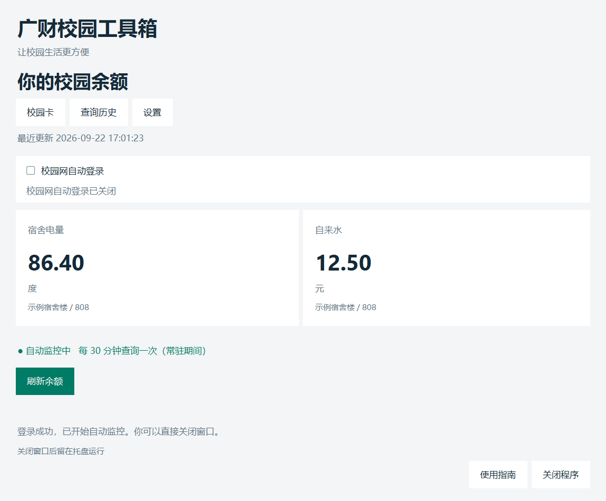
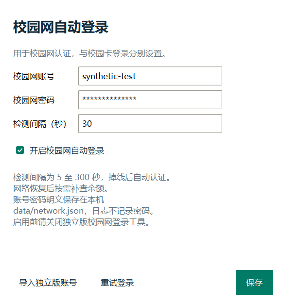
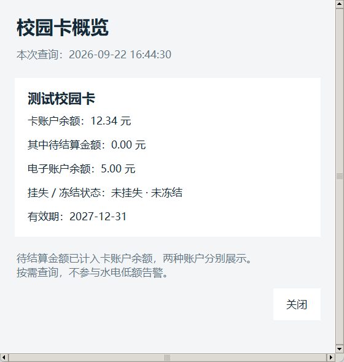

<div align="center">

# 广财校园工具箱

**放在每个财宝电脑里的便捷工具箱。**

查水电、低电预警、自动登录校园网.....

[](https://github.com/cd233ljx/gdufe-campus-balance/releases/latest)

[](LICENSE)

[下载最新版](https://github.com/cd233ljx/gdufe-campus-balance/releases/latest) · [快速上手](#下载与使用) · [反馈问题](https://github.com/cd233ljx/gdufe-campus-balance/issues)

</div>

## 能力总览

面向广东财经大学同学的 Windows 桌面工具。当前提供水电监控、校园卡概览和校园网自动登录，后续会继续加入实用的校园功能.......

| 工具 | 能帮你做什么 | 入口 |
| --- | --- | --- |
| **宿舍水电** | 查看电量、自来水与力王热水余额，每 30 分钟自动查询 | 首页 |
| **低额提醒** | 弹窗与 QQ 邮件告警，同一低额周期只提醒一次 | 设置 |
| **校园网** | 检测网络、自动登录、掉线后尝试重连 | 首页开关 / 设置 |
| **校园卡** | 按需查看账户余额、挂失与冻结状态、有效期 | 首页「校园卡」 |
| **查询历史** | 按日期回看本机查询记录与余额变化 | 首页「查询历史」 |

## 页面预览



<table>
<tr><td align="center"><b>校园网设置</b></td><td align="center"><b>校园卡概览</b></td></tr>
<tr><td width="50%"></td><td width="50%"></td></tr>
</table>

> 特别声明：本项目由个人维护，与学校及校园卡平台无隶属关系。

## 下载与使用

前往 [Releases](https://github.com/cd233ljx/gdufe-campus-balance/releases/latest)，下载 `gdufe-campus-balance-v<版本号>-windows-x64-setup.exe`，双击打开中文安装向导。

- 注：从 v0.5.0 起仅提供安装版和源码包，不再发布便携 ZIP。旧版便携包仍可在历史 Release 找到。


## 特色功能：QQ 邮箱告警

首次设置页面可配置「可选：绑定 QQ 邮箱告警」，之后可以从「设置 → QQ 邮箱告警」进入。
只需填写自己的 `@qq.com` 邮箱和 SMTP 授权码
在 QQ 邮箱网页版的设置中找到 POP3/IMAP/SMTP 服务，开启 SMTP 并生成授权码
- 授权码不是 QQ 登录密码！！！


## 运行条件

- Windows 10/11 x64；已在 Windows 11 验证，Windows 10 尚未实测。
- 已安装 Edge 或 Chrome，能正常访问学校认证及校园卡平台。
- 电脑开机、联网且程序运行时才能查询


## 从源码运行

需要 Windows、Python 3.12+ 和 Edge / Chrome；当前构建使用 Python 3.13。

```powershell
py -3.13 -m venv .venv-windows
.\.venv-windows\Scripts\python.exe -m pip install --require-hashes -r requirements.lock
.\.venv-windows\Scripts\python.exe -m cardsclaim.desktop.app
```

布局验证范围与实现原则见 [窗口适配说明](docs/RESPONSIVE.md)。

## 测试与打包

```powershell
.\.venv-windows\Scripts\python.exe -m unittest discover -s tests -v
.\windows\build-installer.cmd
.\.venv-windows\Scripts\python.exe windows\release.py
```

```powershell
Start-Process .\dist\gdufe-campus-balance\gdufe-campus-balance.exe -ArgumentList '--gui-self-test build/gui-report.json' -Wait
Get-Content build/gui-report.json
```
## 仓库结构

```text
cardsclaim/          程序源码
  desktop/           Windows 窗口、水电监控、校园网重连、校园卡概览及数据存储
tests/               测试
windows/             源码启动、构建、许可收集与发布脚本
requirements.lock   
```

## 许可证

Copyright 2026 CardsClaim contributors. 项目采用 [Apache License 2.0](LICENSE)。第三方依赖保留各自许可证，打包版随附 `THIRD-PARTY-LICENSES`。
